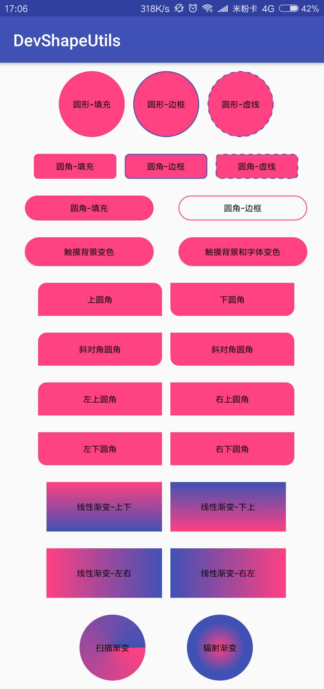

# DevShapeUtils

> **项目初衷：** 公司项目样式文件n+1个，多人开发文件命名各种各样，每次都要搜索半天，我也在网上看了很多类似样式设置库，大多数都是自定义View，我只想代码直接设置样式，比较方便一点，就在闲暇时间写了这个项目，代码直接设置样式，没有太多的属性需要设置，使用简单、为了更方便、快捷、省时的项目开发。
### 1、功能介绍
-------------------
- **Shape样式：** 圆形、圆角、边框、虚线边框、颜色渐变
- **Selector样式：** 触摸背景变化、触摸字体颜色变化


### 2、如何使用
-------------------
#### 2.1 Android Studio导入方法，添加Gradle依赖
在项目的 ``` build.gradle ``` 添加:
``` java
dependencies {
        ...
        implementation 'cn.luliangdev:DevShapeUtils:1.0.3'
        }
```
#### 2.2 项目中使用
##### PS:项目中minSdkVersion设置为16，不然编译通不过。（Android4.1，现在的手机版本基本都在4.4以上）
```java
android {
    defaultConfig {
        ...
        minSdkVersion 16
        ...
    }
}
```
##### 2.2.1 在项目Application中初始化
``` java
public class DevApplication extends Application {
    @Override
    public void onCreate() {
        super.onCreate();
        DevShapeUtils.init(this);
    }
}
```
##### 2.2.2 代码中使用
- **样式设置：<br /> ① DevShapeUtils.xxx.into（view）**--直接设置到相应的view<br />**② DevShapeUtils.xxx.build()**--返回Drawable对象
- **颜色设置：** 所有的颜色设置均可使用&emsp;**R.color.xxx**&emsp;或者&emsp;**#FFFFFF**
- **单位设置：** 项目中所有的数值单位为dp
###### 2.2.2.1 Shape样式
**效果展示：**
 

**代码示例：**
``` java
//椭圆
DevShapeUtils
    .shape(DevShape.OVAL)
    .solid(R.color.colorAccent)
    .into(view);

//矩形
DevShapeUtils
    .shape(DevShape.RECTANGLE)
    .solid(R.color.colorAccent)
    .into(view);

//圆角
DevShapeUtils
    .shape(DevShape.RECTANGLE)
    .solid(R.color.colorAccent)
    .radius(10)
    .into(view);

//方向圆角（top-left方向圆角）
DevShapeUtils
    .shape(DevShape.RECTANGLE)
    .solid(R.color.colorAccent)
    .tlRadius(10)
    .into(view);

//半圆角
DevShapeUtils
    .shape(DevShape.RECTANGLE)
    .solid(R.color.colorAccent)
    .radius(999)
    .into(view);

//实线圆角边框（line 参数1：边框宽度 参数2：边框颜色）
DevShapeUtils
    .shape(DevShape.RECTANGLE)
    .line(1, R.color.colorAccent)
    .radius(10)
    .into(view);

//虚线圆角边框（dashLine 参数1：边框宽度 参数2：边框颜色 参数3：虚线宽度 参数4：虚线间隙宽度）
DevShapeUtils
    .shape(DevShape.RECTANGLE)
    .dashLine(1, R.color.colorPrimary, 5, 5)
    .radius(10)
    .into(view);

//渐变（默认线性上下方向渐变）
DevShapeUtils
    .shape(DevShape.RECTANGLE)
    .gradient(R.color.colorAccent, R.color.colorPrimary)
    .into(view);

//线性渐变（参数：渐变颜色，颜色数量必须两个及以上）
//orientation在gradientLinear之后设置才有效
DevShapeUtils
    .shape(DevShape.RECTANGLE)
    .gradientLinear(R.color.colorAccent, R.color.colorPrimary)
    .orientation(DevShape.TOP_BOTTOM)
    .into(view);

//扫描渐变（gradientSweep 参数1：渐变颜色，颜色数量必须两个及以上）
DevShapeUtils
    .shape(DevShape.OVAL)
    .gradientSweep(R.color.colorAccent, R.color.colorPrimary)
    .into(view);

//辐射渐变（gradientRadial 参数1：辐射范围 参数2：渐变颜色，颜色数量必须两个及以上）
DevShapeUtils
    .shape(DevShape.OVAL)
    .gradientRadial(30, R.color.colorAccent, R.color.colorPrimary)
    .into(view);
```
###### 2.2.2.2 Selector样式
**效果展示：**
![device-2018-02-27-143029 00_00_00-00_00_10 [240p].gif](http://upload-images.jianshu.io/upload_images/2635045-bbdebac4de88620d.gif?imageMogr2/auto-orient/strip)

**代码示例：**
> `Selector`可以自己设置，具体对应关系可以查看 [`Selector`状态详解](https://github.com/LiangLuDev/DevShapeUtils/blob/master/Selector%E7%8A%B6%E6%80%81%E8%AF%A6%E8%A7%A3.md)

``` java
//设置Selector状态 (selector 参数1：Selector状态 参数2：true状态颜色 参数2 false状态颜色)
DevShapeUtils
		.selector(DevSelector.STATE_CHECKABLE,R.color.colorAccent,R.color.colorPrimary)
	    .selectorTextColor("#ffffff", "#000000")
	    .into(button);

//触摸背景颜色变化(selectorPressed 参数1：触摸颜色 参数2 正常颜色)
DevShapeUtils
        .selectorPressed(R.color.colorAccent,R.color.colorPrimary)
        .into(view);

//触摸背景颜色和字体颜色变化(selectorTextColor 参数1：触摸颜色 参数2 正常颜色)
DevShapeUtils
        .selectorPressed(R.color.colorAccent,R.color.colorPrimary)
        .selectorTextColor("#ffffff", "#000000")
        .into(view);

//触摸圆角背景和字体颜色变化
Drawable pressedDrawable = DevShapeUtils
        .shape(DevShape.RECTANGLE)
        .solid(R.color.colorAccent)
        .radius(10)
        .build();
Drawable normalDrawable = DevShapeUtils
        .shape(DevShape.RECTANGLE)
        .solid(R.color.colorPrimary)
        .radius(10)
        .build();

DevShapeUtils
        .selectorPressed(pressedDrawable,normalDrawable)
        .selectorTextColor("#ffffff", "#000000")
        .into(view);

//设置点击事件是否可用(selectorEnable 参数1：可点击颜色颜色 参数2 不可点击颜色颜色)
//设置selector字体颜色只能使用into  只能传入TextView的及子类
DevShapeUtils
        .selectorEnable(R.color.colorAccent,R.color.colorPrimary)
        .selectorTextColor("#ffffff", "#000000")
        .into(button);

//button默认true
button.setEnabled(false);
```
### 3、意见反馈
如果遇到问题或者好的建议，请反馈到：issue、927195249@qq.com 或者LiangLuDev@gmail.com

如果觉得对你有用的话，点一下右上的星星赞一下吧!


### 4、更新日志
##### 1.0.3
- 简化API
- 废弃单独设置`selector`颜色
- 增加快捷设置`selector`两种常用状态  `selectorEnable`和 `selectorPressed`
- 增加`selector`状态设置`selector(DevSelector.STATE_CHECKABLE,R.color.xxx,R.color.xxx)`
##### 1.0.2
- 增加线性渐变方向设置，兼容`Kotlin`使用。

### 5、更多功能
> 由于用户反馈，后面该库会持续更新、完善、增加新的功能，尽量支持日常使用的所有场景，欢迎反馈。

- 增加Shape的另外两种类型Line和Ring
- 背景支持图片
- 样式支持阴影（阴影颜色根据背景颜色）
- 支持XML设置样式
## License
-------------------
> Copyright 2018 Liang_Lu

> Licensed under the Apache License, Version 2.0 (the "License");
   you may not use this file except in compliance with the License.
   You may obtain a copy of the License at

> http://www.apache.org/licenses/LICENSE-2.0

> Unless required by applicable law or agreed to in writing, software
   distributed under the License is distributed on an "AS IS" BASIS,
   WITHOUT WARRANTIES OR CONDITIONS OF ANY KIND, either express or implied.
   See the License for the specific language governing permissions and
   limitations under the License.

