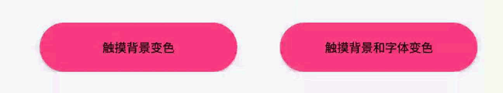

### 代码设置Shape、Selector

#### 样式设置
- **into：** `DevShapeUtils.xxx.into（view）`直接设置到相应的`view`
- **build：** `DevShapeUtils.xxx.build()` 返回`Drawable`对象，使用`view.setBackground(drawable)`设置样式（注意：设置触摸字体颜色变化用此无效）


#### `Shape`样式使用

##### 效果预览
 

##### 代码示例

``` java
//椭圆
DevShapeUtils
    .shape(DevShape.OVAL)
    .solid(R.color.colorAccent)
    .into(view);

//矩形
DevShapeUtils
    .shape(DevShape.RECTANGLE)
    .solid(R.color.colorAccent)
    .into(view);

//圆角
DevShapeUtils
    .shape(DevShape.RECTANGLE)
    .solid(R.color.colorAccent)
    .radius(10)
    .into(view);

//方向圆角（top-left方向圆角）
DevShapeUtils
    .shape(DevShape.RECTANGLE)
    .solid(R.color.colorAccent)
    .tlRadius(10)
    .into(view);

//半圆角
DevShapeUtils
    .shape(DevShape.RECTANGLE)
    .solid(R.color.colorAccent)
    .radius(999)
    .into(view);

//实线圆角边框（line 参数1：边框宽度 参数2：边框颜色）
DevShapeUtils
    .shape(DevShape.RECTANGLE)
    .line(1, R.color.colorAccent)
    .radius(10)
    .into(view);

//虚线圆角边框（dashLine 参数1：边框宽度 参数2：边框颜色 参数3：虚线宽度 参数4：虚线间隙宽度）
DevShapeUtils
    .shape(DevShape.RECTANGLE)
    .dashLine(1, R.color.colorPrimary, 5, 5)
    .radius(10)
    .into(view);

//渐变（默认线性上下方向渐变）
DevShapeUtils
    .shape(DevShape.RECTANGLE)
    .gradient(R.color.colorAccent, R.color.colorPrimary)
    .into(view);

//线性渐变（参数：渐变颜色，颜色数量必须两个及以上）
//orientation在gradientLinear之后设置才有效
DevShapeUtils
    .shape(DevShape.RECTANGLE)
    .gradientLinear(R.color.colorAccent, R.color.colorPrimary)
    .orientation(DevShape.TOP_BOTTOM)
    .into(view);

//扫描渐变（gradientSweep 参数1：渐变颜色，颜色数量必须两个及以上）
DevShapeUtils
    .shape(DevShape.OVAL)
    .gradientSweep(R.color.colorAccent, R.color.colorPrimary)
    .into(view);

//辐射渐变（gradientRadial 参数1：辐射范围 参数2：渐变颜色，颜色数量必须两个及以上）
DevShapeUtils
    .shape(DevShape.OVAL)
    .gradientRadial(30, R.color.colorAccent, R.color.colorPrimary)
    .into(view);
```

#### `Selector`样式使用
##### 效果预览


##### 代码示例

> `Selector`类型可以自己设置，具体对应关系可以查看 [`Selector`状态详解](https://github.com/LiangLuDev/DevShapeUtils/blob/master/Selector%E7%8A%B6%E6%80%81%E8%AF%A6%E8%A7%A3.md)


``` java
//设置Selector状态 (selector 参数1：Selector状态 参数2：true状态颜色 参数2 false状态颜色)
DevShapeUtils
		.selector(DevSelector.STATE_CHECKABLE,R.color.colorAccent,R.color.colorPrimary)
	    .selectorTextColor("#ffffff", "#000000")
	    .into(button);

//触摸背景颜色变化(selectorPressed 参数1：触摸颜色 参数2 正常颜色)
DevShapeUtils
        .selectorPressed(R.color.colorAccent,R.color.colorPrimary)
        .into(view);

//触摸背景颜色和字体颜色变化(selectorTextColor 参数1：触摸颜色 参数2 正常颜色)
DevShapeUtils
        .selectorPressed(R.color.colorAccent,R.color.colorPrimary)
        .selectorTextColor("#ffffff", "#000000")
        .into(view);

//触摸圆角背景和字体颜色变化
Drawable pressedDrawable = DevShapeUtils
        .shape(DevShape.RECTANGLE)
        .solid(R.color.colorAccent)
        .radius(10)
        .build();
Drawable normalDrawable = DevShapeUtils
        .shape(DevShape.RECTANGLE)
        .solid(R.color.colorPrimary)
        .radius(10)
        .build();

DevShapeUtils
        .selectorPressed(pressedDrawable,normalDrawable)
        .selectorTextColor("#ffffff", "#000000")
        .into(view);

//设置点击事件是否可用(selectorEnable 参数1：可点击颜色颜色 参数2 不可点击颜色颜色)
//设置selector字体颜色只能使用into  只能传入TextView的及子类
DevShapeUtils
        .selectorEnable(R.color.colorAccent,R.color.colorPrimary)
        .selectorTextColor("#ffffff", "#000000")
        .into(button);

//button默认true
button.setEnabled(false);
```
#### 注意
> `TextView或者View`等设置`Selector`时，使用`build`方式，先调用`view.setOnClickListener(null)`
